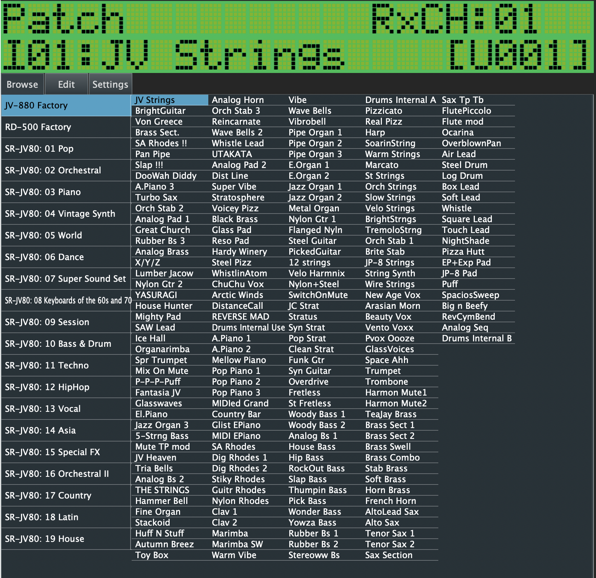

# VirtualJV

JV-880 emulator, as VST/AU plugin. Based on [NukeYKT's SC55](https://github.com/nukeykt/Nuked-SC55).

You'll need ROMs to use this software. During the first run you will be able to open the destination ROM folder. Copy your ROMs there, restart the plugin, and wait for a minute for the first load to happen. Have fun!



## Plugin downloads

- [MacOS AU](https://github.com/giulioz/jv880_juce/releases/download/latest/jv880.component.macOS.zip)
- [MacOS VSTi](https://github.com/giulioz/jv880_juce/releases/download/latest/jv880.vst3.macOS.zip)
- [MacOS Standalone](https://github.com/giulioz/jv880_juce/releases/download/latest/jv880.app.macOS.zip)
- [Windows VSTi](https://github.com/giulioz/jv880_juce/releases/download/latest/jv880.vst3)
- [Windows Standalone](https://github.com/giulioz/jv880_juce/releases/download/latest/jv880.exe)

**NOTE (Windows)**: If you are having troubles with Windows 10, it's possible you need to install the [Visual C++ 2022 Redistributable](https://learn.microsoft.com/en-us/cpp/windows/latest-supported-vc-redist?view=msvc-170#latest-microsoft-visual-c-redistributable-version).

**NOTE (MacOS)**: If you are having troubles with MacOS, it's possible your operating system is blocking the plugin because it's coming from an unregister developer. You can allow this plugin by running this command on a terminal:

```sudo xattr -rd com.apple.quarantine /Users/<yourusername>/Library/Audio/Plug-Ins/Components/jv880.component```

More info on this guide: https://www.osirisguitar.com/2020/04/01/how-to-make-unsigned-vsts-work-in-macos-catalina/
